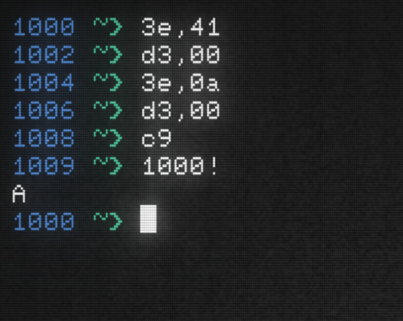

# Ozpex Micro

A fictional 8-bit retro microcomputer built for tkinkerers.




The Ozpex Micro is another architecture + emulator in my Ozpex* family
of fantasy retro computers, alongside the 64 and 128. What makes this
design unique is it's CPU: the Z80. The Z80 has a more rich instruction
set than the 6502, making it much more fun to write assembly for.

The Ozpex Micro's new CPU also brings a new emulator along with it,
offering vastly improved performance through C.

## The Emulator

Currently, the Micro's emulator is still in it's infancy so it does
not have the rich CLI of the 64 or 128. Also, the emulator does not
yet support anywhere near the full instruction set of the Z80. If you
still choose to use this emulator, be aware that you are using a
program that is still vary early in development, and your mileage may
vary.

With that said, to try out the emulator, make sure you have `clang`
installed and [`vasmz80_oldstyle`](http://www.compilers.de/vasm) in your
`PATH`. Then, just use...

```
$ make run
```

...to start the emulator with the ROM monitor loaded.
